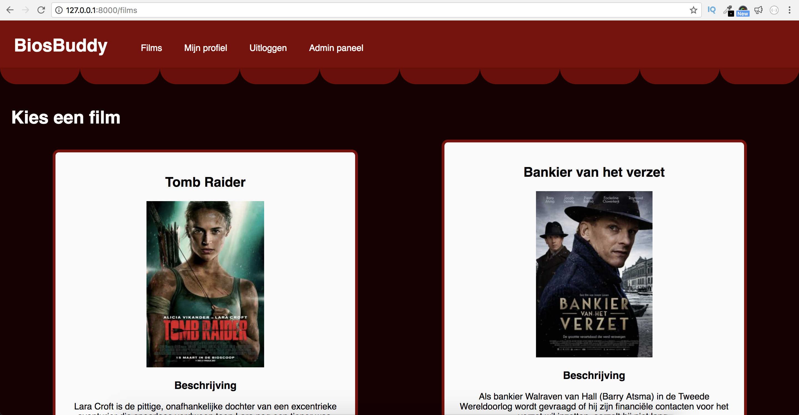

# MovieBuddy V1.0

Hi! Welcome to the very first version of MovieBuddy. A state-of-the-art web-app where you can find a buddy to go to the cinema with.

## About the features

Right now you can do the following with MovieBuddy's:

 - Create an account 
 - Log in
 - Choose a movie
 - Update your profile
 - send a message to a potential match (via email)
 - Admin panel

## Install

 1. Install NPM, Mysql & Brew on your machine (Tutorials can be found at the bottom of the page.)
 2. Fork this repository
 3. git clone https://github.com/bengtbennink/be-assesment-2.git
 4. Install modules
 5. Use Nodemon start to start server

## Additions 05-2019
I have deployed the app via Heroku. It can be found here: [MovieBuddy](https://young-mountain-34305.herokuapp.com/). It was a real struggle to get the app online because several errors popped up inside the Heroku terminal. I've managed to tackle them all with loads of work and some help from [Marijn](https://github.com/Marijnone). Besides that I updated my PackageJSON, added a very big and safe .gitignore and updated the README.md (this file). 

## Install Tutorials 
1. [How to install NPM](https://www.youtube.com/watch?v=rF1ZHmqvm8I)
2. [How to install MySQL](https://www.youtube.com/watch?v=UcpHkYfWarM)
3. [How to install BREW](https://www.youtube.com/watch?v=N-SDrN4G4lE)

